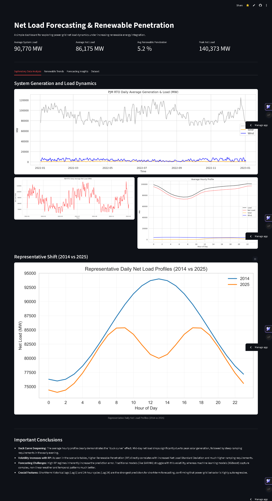
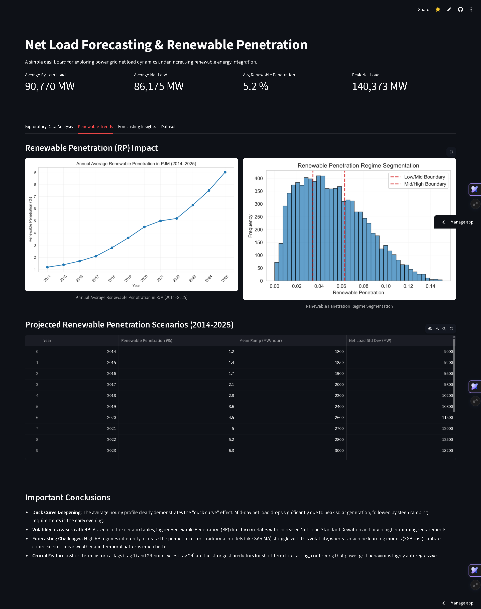
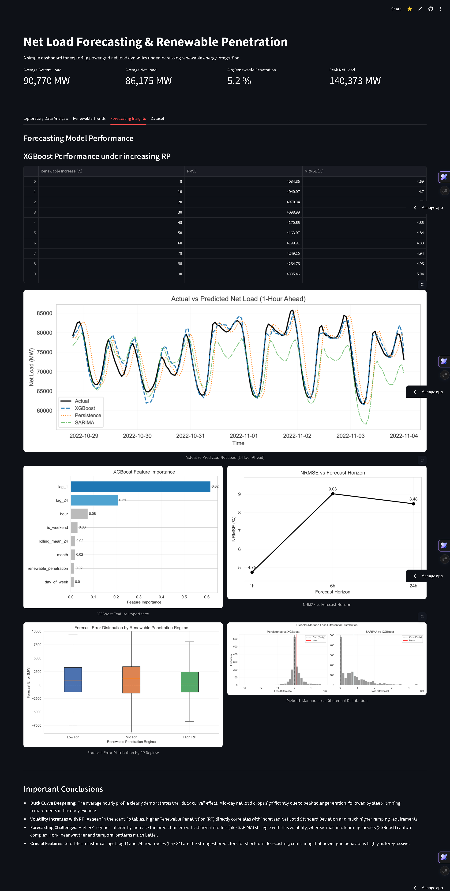
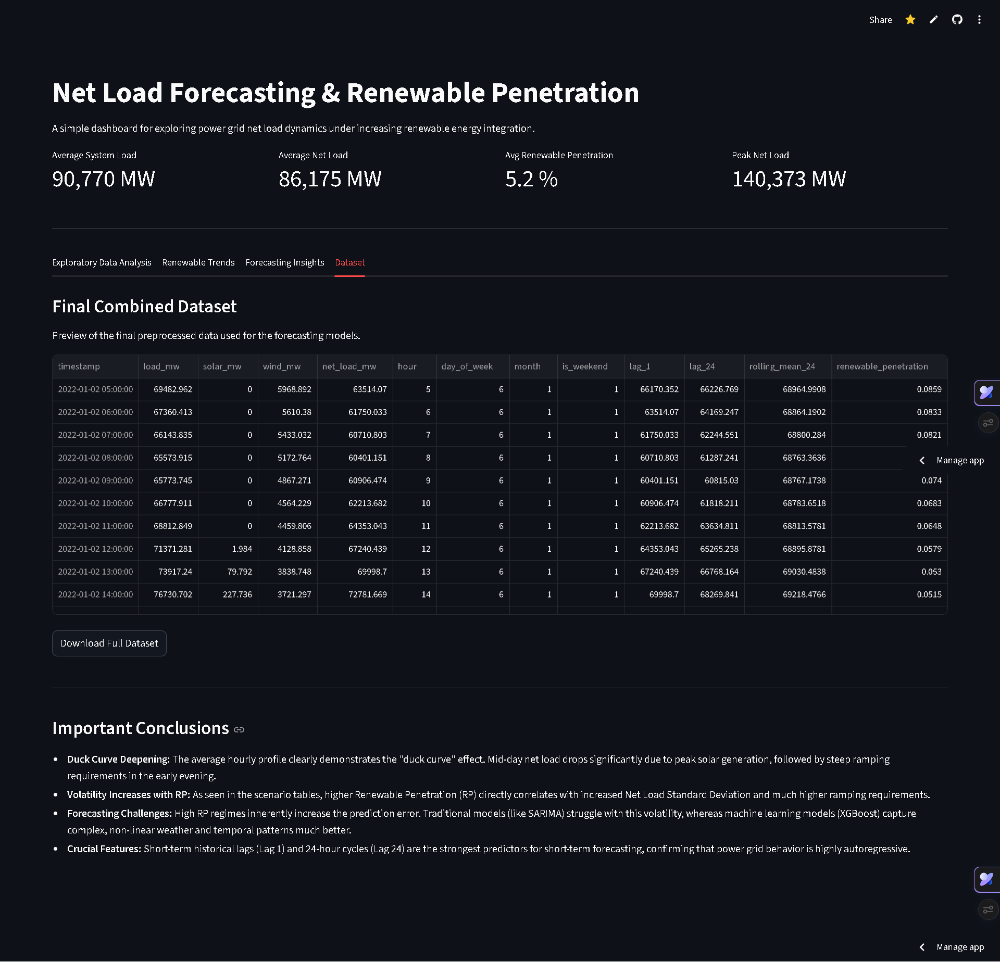

# ⚡ Net Load Forecasting & Renewable Penetration Dashboard

An interactive Streamlit dashboard for analyzing power grid net load dynamics under increasing renewable energy integration — built on PJM RTO data spanning 2014–2025.

🔗 **Live App:** [pjmrtoanalysis.streamlit.app](https://pjmrtoanalysis.streamlit.app)

---

## 📌 Project Overview

As renewable energy penetration grows, forecasting **net load** (total load minus renewable generation) becomes increasingly complex. This project:

- Analyzes **PJM RTO** historical load, solar, and wind generation data (2014–2025)
- Demonstrates the deepening **"duck curve"** effect over time
- Evaluates **XGBoost** forecasting performance under varying renewable penetration (RP) regimes
- Quantifies how increasing RP degrades short-term forecast accuracy

---

## 📊 Dashboard Tabs

### 1. Exploratory Data Analysis
Visualizes system-level load and generation trends, daily net load patterns, and average hourly profiles across all years.



---

### 2. Renewable Trends
Tracks annual renewable penetration growth and shows regime segmentation used for conditional model evaluation.



---

### 3. Forecasting Insights
Displays XGBoost model performance (Actual vs Predicted), feature importance, NRMSE across forecast horizons, and Diebold–Mariano test results.



---

### 4. Dataset
Preview and download the final preprocessed dataset used for all forecasting models.



---

## 🔑 Key Findings

- **Duck Curve Deepening:** Mid-day net load drops sharply due to peak solar generation, creating steep evening ramp requirements — a pattern that has intensified significantly from 2014 to 2025.
- **Volatility Scales with RP:** Higher renewable penetration directly increases Net Load Standard Deviation and ramp requirements, making grid balancing harder.
- **ML Outperforms Traditional Models:** XGBoost captures complex non-linear weather and temporal patterns far better than SARIMA under high-RP conditions.
- **Autoregressive Dominance:** Short-term lags (Lag 1, Lag 24) are the strongest predictors, confirming that net load is highly autoregressive.

---

## 🛠️ Tech Stack

| Tool | Purpose |
|---|---|
| Python | Core language |
| Streamlit | Interactive dashboard |
| Pandas / NumPy | Data processing |
| Matplotlib / Seaborn | Visualizations |
| XGBoost | Forecasting model |
| PJM RTO Data | Source data (load, solar, wind) |

---

## 📁 Project Structure

```
Forecasting data analyis/
│
├── app.py                          # Main Streamlit dashboard
├── stream_utils.py                 # Data loading & plotting functions
├── combined_preprocessed_dataset.csv  # Final merged dataset
├── requirements.txt                # Python dependencies
│
├── Plots/                          # Pre-generated high-res figures
│   ├── fig_Y_final.png
│   ├── fig_RP_trend.png
│   ├── fig6_final.png
│   ├── fig7_final.png
│   ├── fig8_final_with_legend.png
│   ├── fig9_final.png
│   ├── fig10_boxplot.png
│   └── fig11_feature_importance_final.png
│
└── Netload_Forecasting_Local.ipynb # Full analysis notebook
```

---

## 🚀 Run Locally

```bash
# Install dependencies
pip install -r requirements.txt

# Launch the dashboard
streamlit run app.py
```
